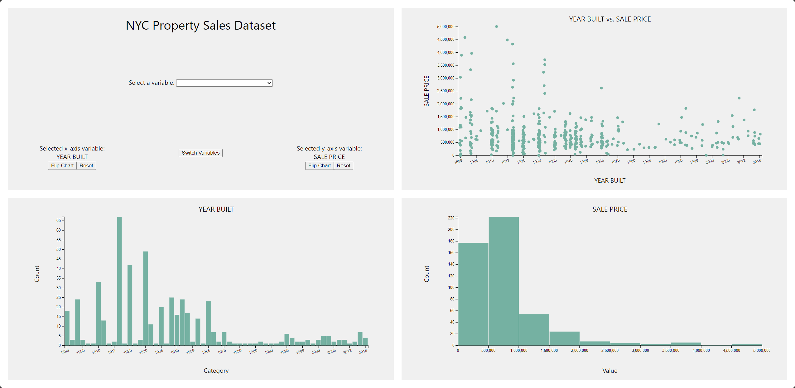

# d3.js Dashboard for the NYC Property Sales Dataset

Dataset source: https://www.kaggle.com/datasets/new-york-city/nyc-property-sales

Simple dashboard showcasing a bar chart for visualizing categorical variables and a histogram for visualizing numerical variables. Scatter plot for visualizing two variables.

## Attributes
_The following list and descriptions only contain the 16 attributes used in the project out of the total 22_

- BOROUGH: A digit code representing the borough in which the corresponding property is located in.
    - 1: Manhattan, 2: Bronx, 3: Brooklyn, 4: Queens, 5: Staten Island
- NEIGHBORHOOD: The neighborhood name that the NYC Department of Finance designates in which the corresponding property is located in.
- TAX CLASS AT PRESENT: The tax class in which the corresponding property is assigned to currently.
    - Class 1: Mostly residential property of up to 3 units
    - Class 2: All other residential properties (co-ops and condos)
    - Class 3: Property with equipment owned by utility companies
    - Class 4: Other properties not included in Class 1, 2, or 3, such as offices, factories, etc.
- BLOCK: A subdivision of the borough. Distinguishes a unit of real property from another, such as different condos in a single building.
- BUILDING CLASS AT PRESENT: Describes a building’s constructive use.
    - Classes from “A” to “Z”, with some examples below:
        - “A”: One family dwellings
        - “B”: Two family dwellings
        - …
        - “Y”: Government/city departments
        - “Z”: Misc. building classifications (tennis courts, UN, post office, etc.)
- ZIP CODE: The corresponding property’s postal code
- RESIDENTIAL UNITS: The number of residential units at the corresponding property
- COMMERCIAL UNITS: The number of commercial units at the corresponding property
- TOTAL UNITS: The total number of units at the corresponding property
- LAND SQUARE FEET: The land area of the corresponding property
- GROSS SQUARE FEET: Total area of all the floors in a building, including the land area and space within any building/structure on the property
- YEAR BUILT: Year that the corresponding property was built
- TAX CLASS AT TIME OF SALE: The tax class in which the corresponding property was assigned to at the time of sale
- BUILDING CLASS AT TIME OF SALE: The building’s constructive use at the time of sale
- SALE PRICE: Price paid for the property
- SALE DATE: Date in which the property was sold

Note: Extremely low sales prices indicate a transfer of ownership, but these cases (< $500) were removed from the data in this project